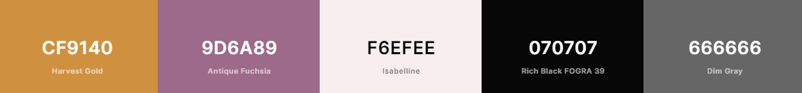

# [Cosyy Coffee](https://1161ef8d-c128-4477-9591-6ac045a22178-00-1kxoasx6mn0js.pike.replit.dev/) - a Coffee Shop Landing Page

This is the landing page for a fictitious coffee shop called "Cosy Coffee" based on [Starbucks'](https://www.starbucks.com/) website design.

**LIVE DEMO** - (https://m23is.github.io/CODSOFT/portfolioM/portfolio.html) 

    
    
    
    

## Table of Contents

- [Design](#design)
  - [Logo](#logo)
  - [Fonts](#fonts)
  - [Color Scheme](#color-scheme)
- [Built With](#built-with)
- [Contributing](#contributing)
- [Creator / Maintainer](#creator--maintainer)
- [Acknowledgments](#acknowledgments)

---

## Design

### Logo

A cup of coffee with a heart and the coffee shop name in a font face that has rounded letters for all the cosy vibes.

Designed and downloaded for free on [FreeLogoDesign](https://www.freelogodesign.org/). _(not sponsored)_

### Fonts

[Nunito](https://fonts.google.com/specimen/Nunito) - this font is used for everything because the roundness in the font gives cosy vibes to match Cosyy Coffee's branding.

### Color Scheme

- Harvest Gold - only used in the logo, but the rest of the color palette was made around it
- Antique Fushia - call to action buttons
- Isabelline - text background color and sign in & join hover background color
- Rich Black FORGRA 39 - black text color instead of normal #000 black
- Dim Gray - footer list items and copyright text

---

## Built With

- [HTML5](https://www.w3schools.com/html/)
- [CSS3](https://www.w3schools.com/css/)
- Hosted on [Netlify](https://www.netlify.com/)

---

## Contributing

Pull requests are welcome. For major changes, please open an issue first to discuss what you would like to change. Please make sure to update tests as appropriate.

### How To Contribute

1. Fork the repository to your own Github account.
2. Clone the project to your machine.
3. Create a branch locally with a succinct but descriptive name.
4. Commit changes to the branch.
5. Following any formatting and testing guidelines specific to this repo.
6. Push changes to your fork.
7. Open a Pull Request in my repository.

---

## Creator / Maintainer

Misba saba([Misba saba](https://github.com/M23is))

If you have any questions, comments, or concerns, feel free to contact me below.

  <a href="mailto:misbasaba31@gmail.com"> 
   myemail
  </a>

This project was created for educational  and intership purposes and for personal and open-source use.

